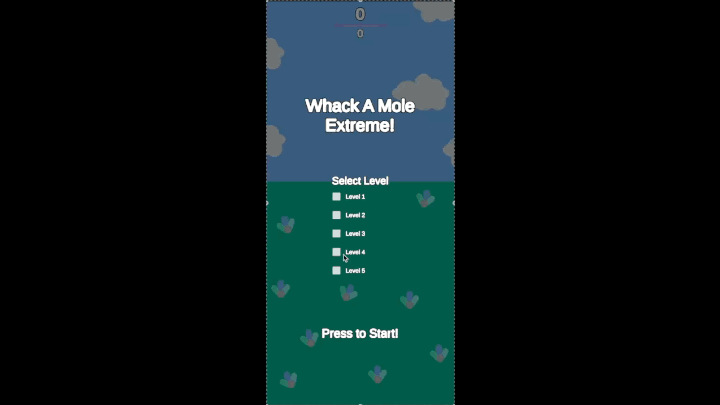
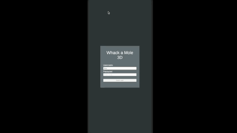
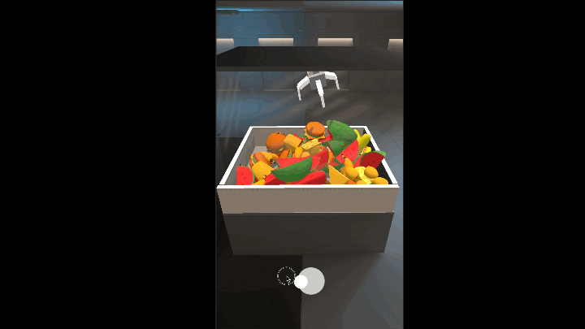
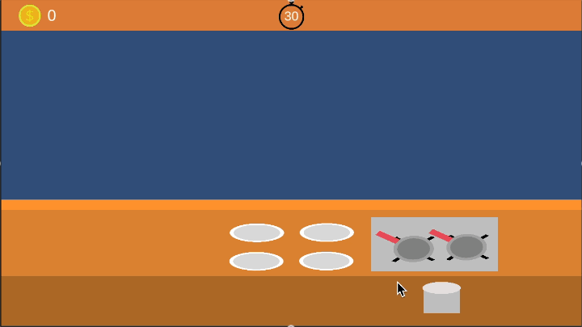

# Hi There! 👋
My name is Kent William and nice to meet you! i am a **Game Developer** with a **Software Engineering** background. Previously, I worked on mobile app development using **Xamarin**, and worked with **Microsoft SQL** and **Firebase databases**. Since graduating from university in 2019, I've been focused on Game Development. I enjoy working in this field because it's challenging, complex, and fun.

i consider my self as a **Generalist**, capable of handling various tasks, but I’m particularly passionate about **UI System**, and creating meaningful player **feedback** which includes sound and visual.

### Interest
1. Building robust audio systems for games
2. Exploring new Unity **UIToolkit** for modern UI workflows

### Contact
Contact me if you need help or anything! 
kentwilliam95@gmail.com

### Quick Game Projects 
#### whackmole
A simple clicking game with Unity engine inspired by cookie clicker and Arcade whack a mole.

#### Tower Defense
Make tower defense game that inspired by Arknights.

#### Smartfox server whack a mole
Whack a mole 3D game that you generally find in arcade game combine it with Server to play Multiplayer.

#### Crane Game
Simple crane game inspired by real life arcade version of it.

#### Cooking Game
Mimicking a cooking game where you can cook and serve to customer base on their requirement.
Inspired by Tasty World: Cafe diner dash

#### BasicRTS
Implementing basic RTS player actions, move player by clicking, picking up objects, and interacting with environment.

<!--
**kentwilliam95/kentwilliam95** is a ✨ _special_ ✨ repository because its `README.md` (this file) appears on your GitHub profile.

Here are some ideas to get you started:

- 🔭 I’m currently working on ...
- 🌱 I’m currently learning ...
- 👯 I’m looking to collaborate on ...
- 🤔 I’m looking for help with ...
- 💬 Ask me about ...
- 📫 How to reach me: ...
- 😄 Pronouns: ...
- ⚡ Fun fact: ...
-->
